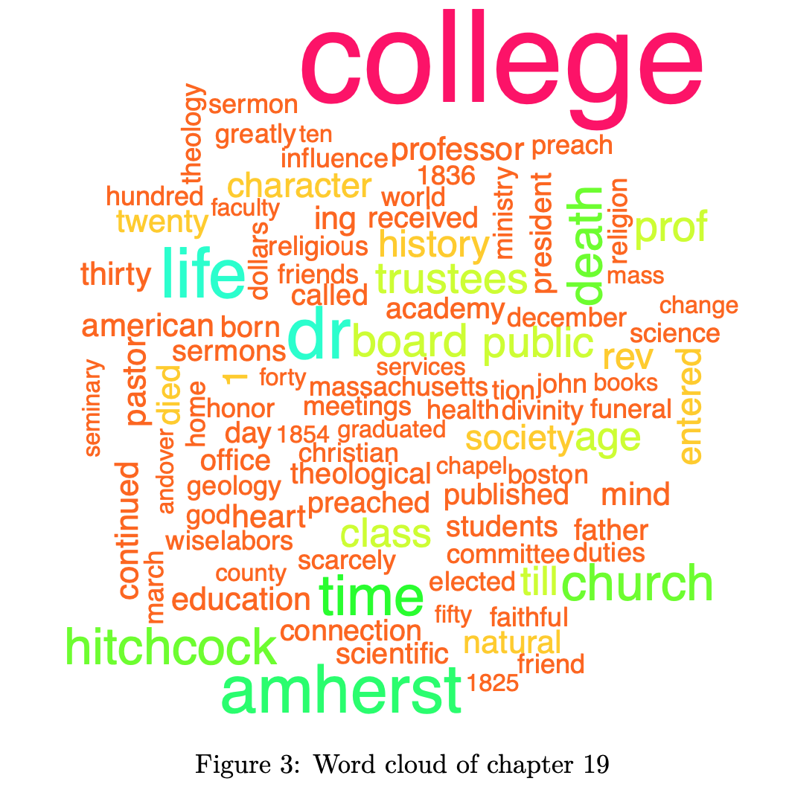

# amherst-history

I worked with a peer in STAT-495 Advanced Data Analysis (taken in fall 2020) to analyze the text ["History of Amherst College During Its First Half Century, 1821-1871"](https://archive.org/details/historyofamherst00tyleiala/page/14/mode/2up) by William Seymour Tyler.

We shared our findings in a pdf report titled ["Amherst History Report"](https://github.com/nfrontero20/amherst-history/blob/master/report/report.pdf) (the Rmd can be found [here](https://github.com/nfrontero20/amherst-history/blob/master/report/report.Rmd)).

## Report highlights 

  - Wrote a function that imports all 29 text files (one for each chapter), cleans them, and returns a dataframe.  The dataframe contains the entire content of the book with rows separating chapters
  - Identified top 10 most frequent words throughout the entire book
  - Identified the top 3 most frequent words for each chapter
  - Identified the top tf-idf [(term frequency-inverse document frequencies)](https://en.wikipedia.org/wiki/Tf%E2%80%93idf) for each chapter
  - Created a word cloud for the entire book and for one particular chapter
    
## Overview of findings

### Top 10 most frequent words in the book:

The top 10 most frequent words in the book, after "college" and "amherst," included words pertaining to three themes: important college personnel (“dr,” “president,” “trustees”); the student body (“students," “class”); religion (“rev,” short for
reverend, "church").

  

### Word cloud of top 100 most frequent words in the book:

A word cloud of the top 100 most frequent words in the book reveals themes that are still pertinent to Amherst College today (“department,” “trustees,” “students,” “dollars,” “fund”), and others that are not (“legislature,” “christian,” “revival,” “academy,” and “seminary”). 
  

  

### Analyzing chapter 19 through three methods

We chose to analyze chapter 19 "Biographical Sketches of Dr. Hitchcock and Some of His Associates" through three different text analysis methods: word frequencies, tf-idf's, and word clouds.  

We first looked at word frequencies in the chapter, and found that the top 3 most frequent words in chapter 19 were "dr," "life," and "time".   We then made a word cloud of chapter 19 to identify the top 100 most frequent words in the chapter (with the size of the words in the cloud signifying their relative frequency in the chapter).

  

Finally, we identified the five words with the highest tf-idf's in chapter 19, which were "survey," "scientific," "hitchcock," "geology," and "comprehensive," indicating that these were the five words were particularly frequent in this chapter when comparing their frequency throughout the entire book.  

From employing these three text analysis methods, we were able to get a very rough summary of the chapter as a whole.  Also, we noticed that certain methods were more helpful than others.  While the top 3 most frequent words in chapter 19 don't tell us much about the chapter, the top 5 tf-idf words signify that mention of Dr. Hitchcock and geology is concentrated in this chapter.  We also found the word cloud to be helpful to get a visual glimpse of the most frequent words in the chapter.

*For more information on Dr. Hitchcock, he is mentioned in detail in the webpage ["A Brief History of Geology at Amherst College"](https://www.amherst.edu/academiclife/departments/geology/about-the-department/brief-history-about-the-department)*

