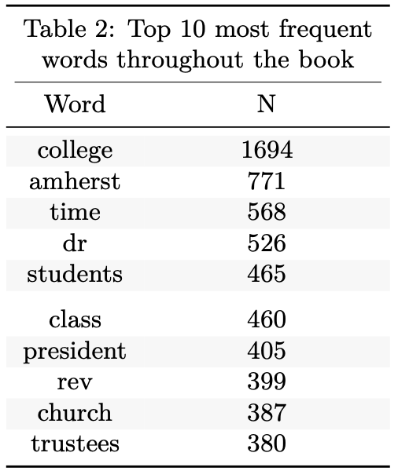
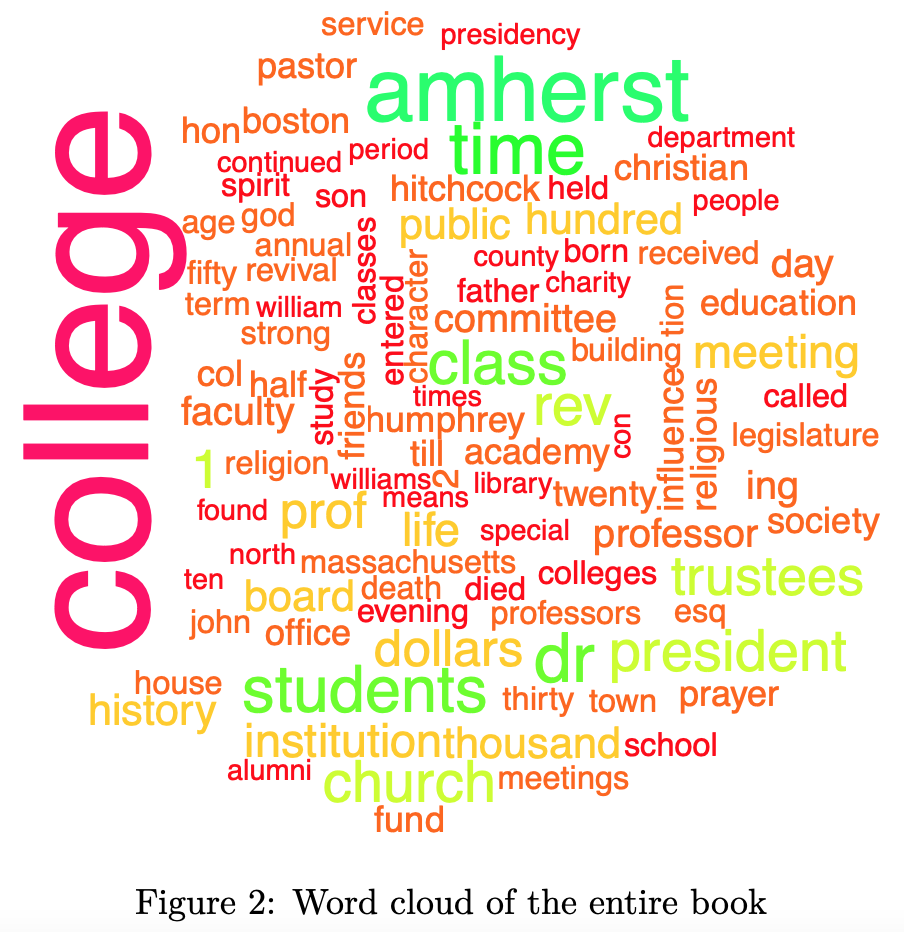

# amherst-history

I worked with a peer in STAT-495 Advanced Data Analysis (taken in fall 2020) to analyze the text [History of Amherst College During Its First Half Century, 1821-1871](https://archive.org/details/historyofamherst00tyleiala/page/14/mode/2up) by William Seymour Tyler.

We shared our findings in a pdf report titled ["Amherst History Report"](https://github.com/nfrontero20/amherst-history/blob/master/report/report.pdf) (the Rmd can be found [here](https://github.com/nfrontero20/amherst-history/blob/master/report/report.Rmd)).

## Report highlights 

  - Wrote a function that imports all 29 text files (one for each chapter), cleans them, and returns a dataframe.  The dataframe contains the entire content of the book with rows separating chapters
  - Identified top 10 most frequent words throughout the entire book
  - Identified the top 3 most frequent words for each chapter
  - Identified the top tf-idf [(term frequency-inverse document frequencies)](https://en.wikipedia.org/wiki/Tf%E2%80%93idf) for each chapter
  - Created a word cloud for the entire book and for one particular chapter
    
## Overview of findings

  1. The top 10 most frequent words in the book, after "college" and "amherst," included words pertaining to three themes: important college personnel (“dr,” “president,” “trustees”); the student body (“students," “class”); religion (“rev,” short for
reverend, "church")

  

  2. A word cloud of the top 100 most frequent words in the book reveals themes that are still pertinent to Amherst College today (“department,” “trustees,” “students,” “dollars,” “fund”), and others that are not (“legislature,” “christian,” “revival,” “academy,” and “seminary”). 
  

  

