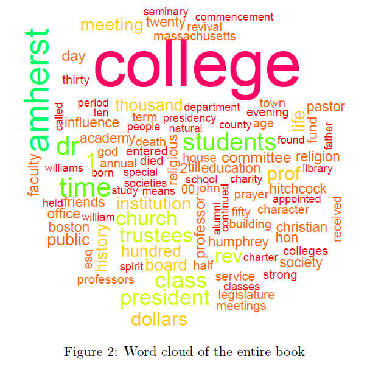

```{r setup, include=FALSE}
library(tidyverse) 
library(rvest)
library(robotstxt)
library(janitor)
library(stringr)
library(tidytext)
library(wordcloud)
library(textdata)
library(stopwords)
library(kableExtra)
library(cowplot)
knitr::opts_chunk$set(
  tidy=FALSE,     # display code as typed
  size="small",
  commment = NA,
  warning = FALSE)   # slightly smaller font for code
```

\newpage

# Executive summary

The book *History of Amherst College During Its First Half Century, 1821-1871* by William Seymour Tyler provides a comprehensive and objective history of Amherst College in its relative infancy, written by an Amherst alumnus and longtime professor.  Using the statistical methods of textual analysis, we wanted to gain a big picture understanding of the content of the entire book, along with examining a few individual chapters to see how they differ from the book as a whole.  We hoped that this information would not just help us understand this book in particular, but allow us to glean the topics and themes of Amherst College in its first 50 years, which in turn would help us understand how Amherst College has evolved from its first half century to its bicentennial this academic year.

To accomplish this goal, we used word frequencies, which provide a measure of the most used words both by chapter and throughout the entire book; term frequency-inverse document frequencies (tf-idf's), which weigh word frequencies per chapter against each word's usage throughout the book, providing a sense of which words were particularly important to certain chapters; and word clouds, which express a great number of word frequencies in a compact (i.e. much smaller than a table) and visually pleasing way.  We performed every analysis method on both the book as a whole and on the individual chapters (except for tf-idf's, which we performed only on individual chapters).  We have included the word cloud for the entire book in this summary below, to provide an overview and example of the type of analysis we did in this report.

```{r, echo = FALSE, fig.align='center'}
# Note that code to generate this graph is given in the Analysis section

```

When we look at figure 2, we see many words that we would still characterize as being pertinent to Amherst College today.  For example, "department," "trustees," "students," "dollars," and "fund" are all words that color our current conversations and experiences as Amherst College students over 150 years later.  However, there are also words in figure 2 that are, albeit not absent, less relevant to the present day Amherst experience, such as "legislature," "christian," "revival," "academy," and "seminary." The difference between the words that characterize Amherst in this book, and the words that we may use when discussing Amherst highlights the ways in which Amherst has changed in the past century and a half. 

Performing text analysis on this book allowed us to extract and distill the key information from 722 pages detailing the first 50 years of Amherst history in an efficient and concise manner.  Looking at the book as a whole, we noticed that there were many academic and financial themes that continue to this day, but we also noticed many religious themes that are not as pertinent to the college now.  Additionally, we were able to illustrate the themes of individual chapters and how they changed over time, also giving a sense of the progression of Amherst's history through its first 50 years on account of the book's chronological structure.  While reading a book obviously is one way to gather information, and a potent one at that, we have learned that text analysis can provide important summary measures for a text accessible to people who have not done the hard work of reading the book, and even can allow for identifying patterns that may not be easy to recognize, and perhaps even impossible to quantify, when reading.

\newpage

# Wrangling

## Importing and cleaning data

The book has 29 chapters, all of which we wanted to investigate.  We wrote a function that imports all of the text files, cleans them, and returns a dataframe with a row for every chapter that contained both the chapter number and a string of the text within the chapter.  

```{r}
# Making vector of the paths for all of the txt files in the folder
fileNames <- Sys.glob("../book-raw-files/chapters/*.txt")
```

```{r, cache=TRUE}
# Function to clean up every chapter and save each chapter as a string
# It returns a dataframe with chapter numbers and string

make_string <- function(fileNames) {
  # Create vector for results
  chapter_strings <- rep("", length(fileNames))
  
  ## For each file in the folder...
  for(j in 1:length(fileNames)){
    
    # Create the chapter dataframe from the .txt file
    chapter <- read.delim(fileNames[j], quote = "")
      
    # Remove the "-  " and " 00"
    cleaned_vector <- rep("", nrow(chapter))
    for (i in 1:nrow(chapter)) {
      cleaned_vector[i] <- str_remove(chapter[i, 1], "-  ")
      cleaned_vector[i] <- str_remove(chapter[i, 1], " 00")
    }
    
    # Make the entire chapter into one string
    chapter_string <- ""
    for (i in 1:nrow(chapter)) {
      chapter_string <- paste(chapter_string, cleaned_vector[i], sep = "")
    }
    
    # Add the string for each chapter to the vector
    chapter_strings[j] <- chapter_string
    
  }
  
  # Create chapter numbers
  chapter_number <- seq(from = 0, to = length(fileNames) - 1, by = 1)
  
  # Make a dataframe with chapter numbers and chapter strings
  book_df <- cbind.data.frame(chapter_number, chapter_strings)
  
  # Return the book
  return(book_df)
}

# Run the function on all of the txt files
book <- make_string(fileNames)
```

## A glimpse of the cleaned dataframe

It might be helpful for some to see a few lines of each chapter, so we created a table (table 1) that shows the first 250 characters of each chapter.

The original format of the book spanned several files, which each contained many formatting issues, such as unnecessary characters and words cut off between lines.  Our wrangling addressed these issues and created one dataframe containing a row for each chapter, with the content of that chapter saved as a string.  To provide a glimpse into the results of our wrangling, we print a table showing the first 250 characters of each chapter.  Note that the saved dataframe that we will use for analysis contains the entire chapter in each row, not just the 250 characters that we print here.

```{r, cache=TRUE}
# Get the first 250 characters of each chapter
head_book <- rep("", nrow(book))
chapter_number <- seq(from = 0, to = length(fileNames) - 1, by = 1)

for(i in 1:nrow(book)){
  head_book[i] <- substr(book[i, 2], start = 2, stop = 252)
}

head_book_df <- cbind.data.frame(chapter_number, head_book)
colnames(head_book_df) <- c("Chapter", "First 250 characters")
```

```{r}
# Run kable on the table
kable(head_book_df, 
      "latex", booktabs = T, align=c("c", "l"), longtable = TRUE) %>%
  kable_styling(latex_options = c("HOLD_position", "striped", "repeat_header"),
                font_size = 9) %>% 
  column_spec(2, width = "13cm") %>%
  add_header_above(c("Table 1: First 250 characters of each chapter" = 2)) %>% 
  row_spec(1:4, hline_after = TRUE) %>% 
  row_spec(6:19, hline_after = TRUE) %>% 
  row_spec(21:28, hline_after = TRUE)
```

# Analysis

## Word frequencies throughout the entire book

The first piece of analysis that we want to perform involves finding what the most frequently used words are throughout the book.  Before performing this analysis, we removed stop words from the entire book so that we don't count words often used in writing such as "a," "the," "and," "it," etc.  Table 2 shows the ten words (excluding stop words) that show up with the most frequency throughout the book.  

```{r}
# Taking stop words out
book_no_stop_words <- book %>%
  unnest_tokens(output = word, input = chapter_strings) %>%
  anti_join(stop_words, by = "word")
```

```{r, message = FALSE}
# Word frequencies throughout the entire book
total_word_freqs <- book_no_stop_words %>%
  group_by(word) %>%
  summarize(n = n()) %>%
  arrange(desc(n))

# Change column names
colnames(total_word_freqs) <- c("Word", "N")
```

```{r}
# Run kable on the table
total_word_freqs %>%
  head(n=10) %>%
  kable("latex", booktabs = T, align=rep("c", 2)) %>%
  kable_styling(latex_options = c("HOLD_position", "striped"), font_size = 9) %>%
  add_header_above(c("Table 2: Top 10 most frequent\nwords throughout the book" = 2))
```

Table 2 shows that, unsurprisingly, the two words that show up with the most frequency in the book are "college" and "Amherst".  The next 8 most frequent words to appear in the book seem to generally pertain to three themes: important college personnel, which we see through the words “dr,” “president,” and “trustees”; the student body, as communicated through “students” and “class”; and religion, which “rev” (short for reverend) and “church” suggest.

## Top three most frequent words in each chapter

In addition to looking at word frequencies throughout the book as a whole, it will also be helpful for us to learn what the words most frequently used in each chapter are.  We may expect most chapters to have "college" or "amherst" be the most frequently used word in that chapter, especially given that these two words are the most frequently used words in the book.  With this in mind, we remove "amherst" and "college" from this analysis, along with stop words, which are unimportant words frequently used in writing such as "a", "as," "the," etc.

```{r, message = FALSE}
# Remove "amherst" and "college" from this analysis
book_no_amherst_college <- book_no_stop_words %>% 
  filter(word != "college") %>% 
  filter(word != "amherst")

# Getting word frequencies for all words in each chapter
chapter_freqs <- book_no_amherst_college %>%
  group_by(chapter_number, word) %>%
  summarize(n = n()) %>%
  ungroup()

# Getting the top 3 most frequent words for each chapter
chapter_most_freq <- chapter_freqs %>%
  arrange(desc(n)) %>%
  group_by(chapter_number) %>%
  slice_head(n = 3)

# Creating variable for word number
word_numbers <- c("word1", "word2", "word3")
word_numbers_vector <- rep(word_numbers, 29)

# Binding the top 3 most frequent words by chapter with word numbers
word_freq_df <- cbind(chapter_most_freq, word_numbers_vector)

# Changing column name for the word numbers column
colnames(word_freq_df)[4] <- c("word_numbers")

# Selecting all columns besides the column with the count of each word
word_df <- word_freq_df %>% select(chapter_number,
                              word,
                              word_numbers)

# Making our data into wide format
word_spread <- word_df %>% spread(key = word_numbers, 
                                  value = word)

# Changing column names
colnames(word_spread) <- c("Chapter", "Most frequent word", 
                           "Second most frequent word", "Third most frequent word")
```

```{r}
# Run kable on the table
kable(word_spread, "latex", booktabs = T, 
      align=c("c", "l", "l", "l")) %>%
  kable_styling(latex_options = c("HOLD_position", "striped"),
                font_size = 9) %>% 
  add_header_above(c("Table 3: Top 3 most frequent words in each chapter" = 4))
```

Table 3 displays the 3 most frequent words to appear in each chapter along with the number of occurrences of these words.  While we will not examine every single chapter listed here, we provide a sample interpretation for the findings of one chapter.  Chapter 25's most common words are "dollars," "thousand," and "life".  From these words, we might deduce that this chapter is about the lives of donors to the college.  Upon a cursory examination of the content of chapter 25, we see that the chapter is titled “Benefactors of the College” and details the lives of those who donated to the Charity Fund.  For an in-depth understanding of the lives of these benefactors, we would naturally want to read the entire chapter, but it is interesting how just by identifying word frequencies for this chapter, we can get a general sense for the chapter’s content.  However, while seeing the word frequencies was an interesting exercise, in practice it did not provide much more insight beyond the chapter's title, which conveys similar information.

## Top tf-idf's for each chapter

The next step in our analysis was finding the term frequency-inverse document frequencies (tf-idf's) of words in each chapter.  tf-idf's are basically a measure of how common words in a chapter are (which is the term frequency, or tf part of tf-idf) relative to how common they are in the entire book (which is their inverse document frequencies, or the idf part of tf-idf).  For example, "college" and "amherst," as we saw earlier, were the two most common words throughout the book, so even though they were common words in a lot of chapters, their tf-idf's would nonetheless be pulled down due to how common they were throughout the entire book.  Consequentially, tf-idf's help us identify certain words that may be distinct to and more common in specific chapters than the rest of the book.

With this information, analogous to our table of top word frequencies per chapter, we will construct table 4, a table showing the word with the highest tf-idf in each chapter.  In addition to the word, chapter, and tf-idf, this table also show each word's number of occurrences in the chapter, tf, and idf.  

```{r}
# Chapter counts
chapter_counts <- book_no_stop_words %>%
  group_by(chapter_number, word) %>%
  count()

# tfidf's
tfidf <- chapter_counts %>%
  bind_tf_idf(term = word, document = chapter_number, n = n)
```

```{r}
# Getting top tf-idf for each chapter
top1_tfidf <- tfidf %>%
  arrange(desc(tf_idf)) %>%
  group_by(chapter_number) %>%
  slice(1) %>%
  ungroup() %>% 
  select(chapter_number, word, n, tf_idf)
  
# Changing column names
colnames(top1_tfidf) <- c("Chapter", "Word", "N", "tfidf")

# Rounding
top1_tfidf$tfidf <- round(top1_tfidf$tfidf, 4)
```

```{r}
# Run kable on the table
kable(top1_tfidf, "latex", booktabs = T, align=rep("c", 4)) %>%
  kable_styling(latex_options = c("HOLD_position", "striped"), font_size = 9) %>%
  add_header_above(c("Table 4: Top tf-idf per chapter" = 4))
```

We also graphed the top 5 tf-idf's for each chapter (see Figure 1 below).

```{r}
# Getting data frame of top 5 tf-idf's per chapter (for graphing)
top5_tfidf <- tfidf %>%
  arrange(desc(tf_idf)) %>%
  group_by(chapter_number) %>%
  slice(1:5) %>%
  ungroup()
```

```{r, fig.height = 10, fig.cap="Top 5 tf-idf's for each chapter in the book"}
# Plotting tfidf for each chapter
ggplot(top5_tfidf, aes(x = reorder(word, tf_idf), y = tf_idf, fill = chapter_number)) +
  geom_col(show.legend = FALSE) +
  labs(x = NULL, y = NULL) +
  facet_wrap(~ chapter_number, scales = "free", ncol = 4) +
  coord_flip() +
  theme(axis.text.x = element_text(angle = 90))
```

As apparent in table 4 and figure 1, the word with the top tf-idf varies between each chapter.  Also note that for every chapter, the words with the top tf-idf are different than the most frequently used word in that chapter.  With table 4 and figure 1, we are able to identify words that are somewhat unique in prevalence in a given chapter as compared to their prevalence throughout the book as a whole.  

For example, the top words in terms of tf-idfs for chapter 19, as shown in figure 1, are "scientific," "hitchcock," and "geology," in contrast with the top word frequencies in this chapter, shown in table 3, which are "dr," "life," and "time".  While the latter 3 words were used more in the chapter than the 3 with the highest tf-idfs, these words were common to the entire book, exemplified by "dr" being the 4th most used word in the entire book, as listed in table 2.  The words with the highest tf-idfs instead are the ones more unique to the chapter.  Note as well that because of this difference, tf-idfs seem to provide an even better picture into a summary of a chapter than word frequencies.  The top 3 most frequent words for chapter 19, "dr," "life," and "time," could indicate that the chapter pertains to any person with a high educational status.  However, the top 3 tf-idfs, "scientific," "hitchcock," and "geology," tell us that the chapter is about a geologist or scientist named Hitchcock, a correct sentiment considering the chapter is titled "Biographical sketches of Dr. Hitchcock and some of his associates" (and considering Dr. Hitchcock was a geologist).

## Word clouds

In addition to using word frequencies and tf-idf's to analyze the text, we can also use word clouds.  Word clouds aren't necessarily a way to formally analyze text, but instead are beneficial when trying to visualize the text.  A word cloud shows the most common words in a document and uses font size as a way to communicate the prevalence of a word in a document.  Words in a word cloud that are very large are used more frequently in a document than are words that are very small.  Note that unlike table 3, we included "amherst" and "college" in our word clouds below.  Even though they were the most common words in the book and likely many individual chapters as well, we didn't see that much harm of including them in a diagram with 100 words, and also it might be useful to see the comparison in size between these two oft-used words and less commonly used words.

First, we will look at a word cloud of the entire book.  

```{r, fig.align="center", fig.width=8, fig.length=8, fig.cap="Word cloud of the entire book"}
# Wordcloud of entire book
set.seed(634253)
book_no_stop_words %>%
  count(word, sort = TRUE) %>%
  with(wordcloud(word, n, max.words = 100, colors = rainbow(15)))
```

Figure 2 is a word cloud of the entire book.  The largest words in the word cloud are mostly the same words that we see in table 2 as appearing most frequently throughout the book.  A word cloud and a table of word frequencies, like table 2, are two different ways of looking at the frequencies of words in the book.  However, a word cloud can sometimes be easier for a reader to gain information from because of the use of color and size, and because a large amount of words can be displayed in a small amount of space.

We can also make word clouds for individual chapters.  We will look specifically at a word cloud for chapter 19 so that we can gain better insight into this chapter beyond our earlier investigation.

```{r, fig.align="center", fig.width=8, fig.length=8, fig.cap="Word cloud of chapter 19"}
# Wordcloud for chapter 19
set.seed(6342)
book_no_stop_words %>%
  filter(chapter_number == 19) %>%
  count(word, sort = TRUE) %>%
  with(wordcloud(word, n, max.words = 100, colors = rainbow(15)))
```

When we look at the word cloud for chapter 19, we see that "college," "amherst," and "dr" are some of the most frequent words in the chapter, which is unsurprising given that these three words are some of the most common words throughout the entire book (see table 1).  This word cloud also allows us to see a variety of other words that are likely more chapter specific, including "hitchcock," one of the words we identified with tf-idf's; "church"; and "theology".

# Discussion

When working on this text analysis project, we learned that there is a significant amount of wrangling and cleaning required before any analysis can be performed.  For example, we had to remove dashes and spaces that were separating words into multiple parts.  We performed multiple types of text analysis and learned throughout the process that there is no single analysis method that allows us to tell the whole story of the book.  Rather, each method adds some information, but particular methods can be more more informative than others.  

We found that looking at the tf-idf's for words in each chapter was the most informative in helping us learn the general topics of each chapter.  Whereas the word frequencies for each chapter seemed to mostly reflect the most frequent words throughout the book, the tf-idf's for each chapter allowed us to see more chapter-specific terms.  Additionally, with regards to the word clouds, we found that the largest words did not add any information that we had not already learned from the word frequencies.  However, the word clouds did allow for us to view the 100 most frequently used words in a given chapter in a visually appealing way, which also aided in our efforts to understand the topics and themes of each chapter.   

In addition to learning about text analysis in general, we also learned a lot about this book, and by extension, about Amherst College.  From word frequencies and word clouds of the entire book, we learned about the overall themes of Amherst College in its first half century.  Comparing these themes to those of Amherst today, we might notice that certain themes of the academic and financial or fund raising variety have continued to this day.  However, we might also notice that the many religious and seminary themes have since declined since Amherst's founding and early years.  In addition to gaining an overall understanding of the entire book and first 50 years of Amherst College, we were also able to determine the themes of a few chapters.  For example, we examined chapter 19 as a case study to see how all of the text analysis methods that we employed can help us understand more about a given chapter.  While the scope of this project did not allow for us to dive into every chapter in as much depth as we did for chapter 19, in continuing our research we would consider performing such thorough analyses on all chapters. 

# Technical Appendix

Within our report, the wrangling that we did stands out as a particularly strong component.  By establishing `fileNames` using `Sys.glob("chapters/*.txt)`, we were able to create an object that contained the relative file paths for each chapter of the book with just one line of code.  The `make_string` function, which performed all of our wrangling, took in `fileNames` as the input.  The function allowed us to import all of the chapter files and remove unwanted characters from the text, such as dashes that were separating words between lines, by using `str_remove`.  Also, the function returned a dataframe with a row for every chapter that contained both the chapter number and a string of the text within the chapter.  

Writing this function allowed us to code efficiently and to avoid having an unnecessary number of lines of code in our wrangling section.  By taking `fileNames` as an input, our function just takes one argument and yields a dataframe with all of the files' contents.  Also, our function is well commented so it is clear to a reader of our report what all of the lines in the function do.  Because of function returned the dataframe, it was very simple for us to display a little bit of each chapter (see table 1).   
